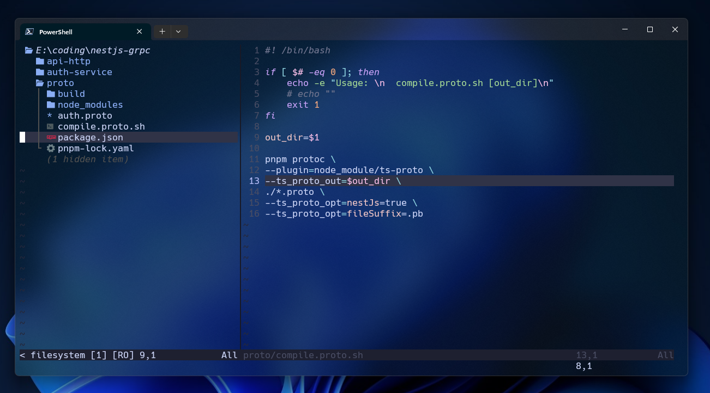

# dotfiles



## Configs

- Neovim
- Powershell

## ⚙ Requirements

- **Neovim:**

  - Neovim >= v0.8.1
  - [Nerd Fonts](https://www.nerdfonts.com/font-downloads)
  - NodeJS with npm
  - [Packer](https://github.com/wbthomason/packer.nvim) installed
  - A C compiler in your path and libstdc++ installed: [Windows support](https://github.com/nvim-treesitter/nvim-treesitter/wiki/Windows-support)
  - [Git](https://git-scm.com/downloads)

- **Powershell**:
  - [Oh My Posh](https://ohmyposh.dev/docs/installation/windows)

### 🚀 Installation

Clone the repository.

```bash
git clone https://github.com/300degree/dotfiles.git
```

Move nvim directory from `/dotfiles/.config/` to

- **Windows**: `$env:LOCALAPPDATA\nvim\`

- **Linux**: `~/.config/nvim`

and run the command:

```bash
nvim +PackerSync
```

or in Neovim Editor:

```bash
:PackerSync
```
