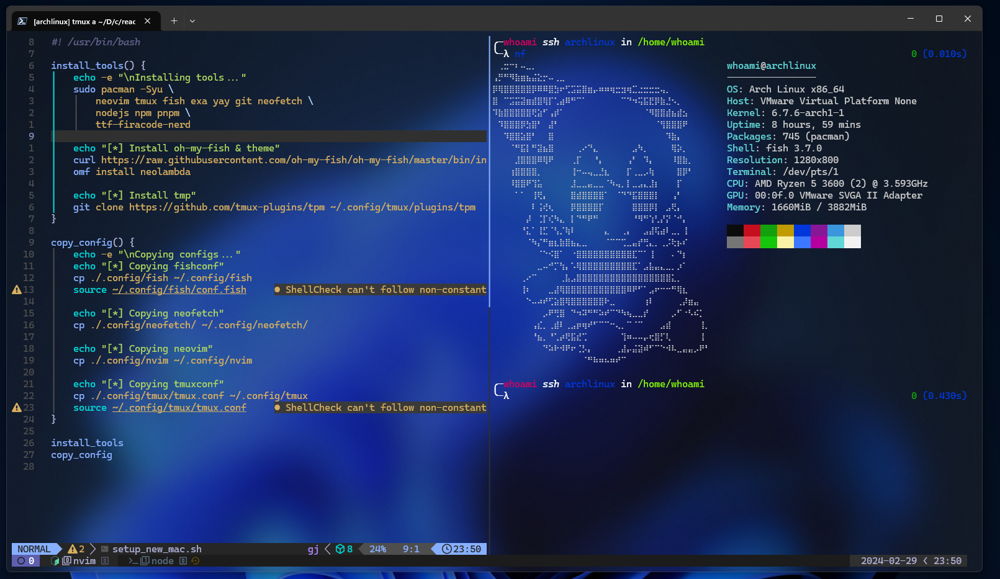

<!-- # dotfiles -->

<!--  -->

## Configs

- Vim
- Tmux
- Zsh

## Requirements and tools that I use

- [Vim](https://github.com/vim/vim)
- [Tmux](https://github.com/tmux/tmux)
- [Zsh](https://www.zsh.org/)

### 🚀 Installation

```bash
sh -c "$(curl -sSL https://raw.githubusercontent.com/300degree/dotfiles/main/setup.sh)"

```
