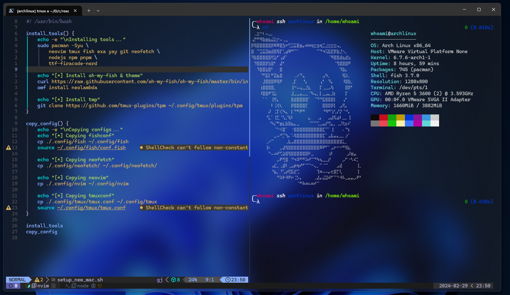

# dotfiles



## Configs

- Neovim
- Neofetch
- Tmux
- fish & ohmyfish

### 🚀 Installation

Clone the repository.

```bash
git clone https://github.com/300degree/dotfiles.git
```

and run setup_new_arch:

```bash
sh ./setup_new_arch.sh
```
